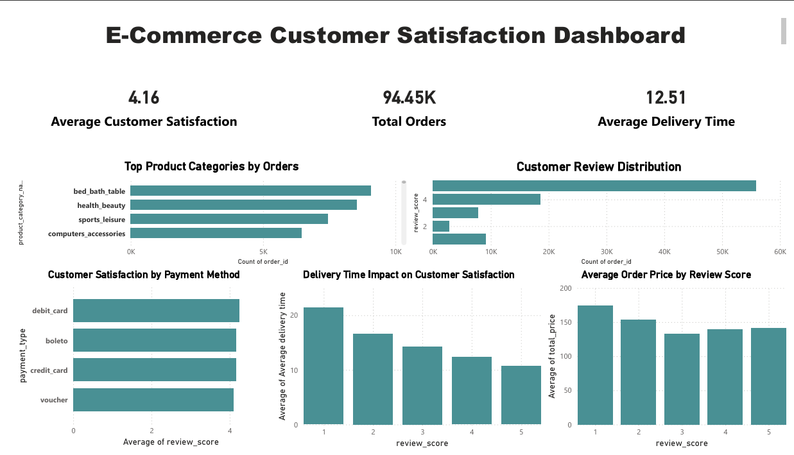

# E-Commerce Customer Satisfaction Analysis

This project analyzes customer satisfaction in an e-commerce platform using transactional data extracted from a SQL database. The objective of this project is to explore the key factors that influence customer satisfaction and visualize insights using an interactive Power BI dashboard.

---

## Project Overview

Customer satisfaction plays a critical role in the success of e-commerce businesses. Companies must continuously analyze customer feedback, operational performance, and purchasing behavior to improve their services.

In this project, we analyze an e-commerce dataset containing approximately **94,000 orders** to identify patterns related to:

- Customer reviews
- Delivery performance
- Product categories
- Payment methods
- Order prices

The analysis was conducted using SQL, Python, and Power BI to generate meaningful insights about customer experience.

---

## Technologies Used

The following tools and technologies were used in this project:

- **SQL** – Data extraction from the database
- **Python (Pandas)** – Data cleaning and exploratory data analysis
- **Power BI** – Interactive dashboard visualization
- **GitHub** – Project version control and portfolio presentation

---

## Dataset

The dataset was extracted from an e-commerce relational database using SQL queries.

Each record represents a single customer order and includes several attributes such as:

- `order_id`
- `customer_unique_id`
- `purchase_hour`
- `purchase_day_of_week`
- `delivery_time_actual`
- `delivery_diff`
- `product_category_name_english`
- `total_price`
- `total_freight`
- `payment_type`
- `review_score`

The dataset contains approximately **94,000 transactions**.

---

## Project Workflow

The analysis followed a structured data analytics workflow:

1. **Data Extraction**
   - Extracted relevant data from the database using SQL queries.

2. **Data Cleaning**
   - Removed missing values
   - Verified data types
   - Checked for duplicate records

3. **Exploratory Data Analysis**
   - Investigated relationships between delivery time, price, and review scores.

4. **Visualization**
   - Built an interactive dashboard using Power BI to present insights.

---

## Dashboard Visualizations

The Power BI dashboard includes several visualizations designed to analyze customer satisfaction:

### Customer Review Distribution
Shows how customer ratings are distributed from 1 to 5.

### Delivery Time Impact on Customer Satisfaction
Analyzes how delivery performance affects customer review scores.

### Top Product Categories by Orders
Identifies the most frequently purchased product categories.

### Customer Satisfaction by Payment Method
Compares average review scores across payment methods.

### Average Order Price by Review Score
Examines whether order price affects customer ratings.

---

## Key Insights

The analysis revealed several important insights:

- Customer satisfaction is generally high with an average rating above **4.1 / 5**.
- Faster delivery times are strongly associated with higher customer ratings.
- Product categories such as **bed & bath, health & beauty, and sports & leisure** dominate order volume.
- Payment methods have minimal impact on customer satisfaction.
- Order price does not significantly influence customer review scores.

---

## Dashboard Preview

*(Insert a screenshot of your Power BI dashboard here)*

Example:

---

## Project Structure
